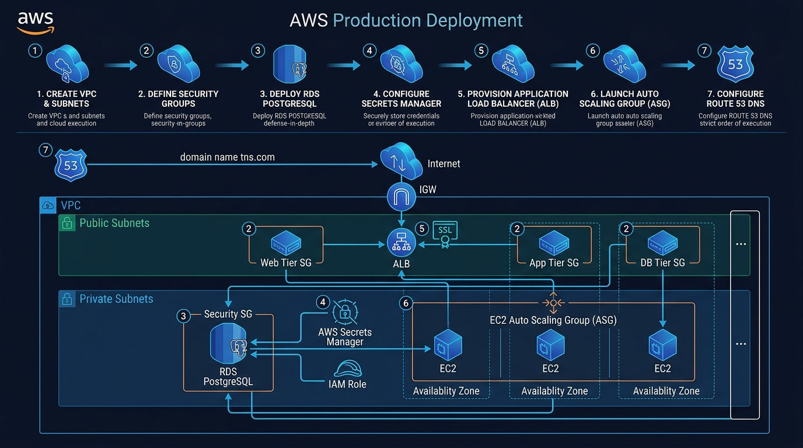

# ☁️ Project 4: AWS Production Deployment (Hands-On Cloud Architecture) 🚀

Welcome to **Project 4: AWS Production Deployment**! This project guides you step-by-step through designing, building, securing, and scaling a **production-grade, multi-tier cloud infrastructure** on Amazon Web Services (AWS) using the **AWS Management Console**. 🌟

---

## 🏗️ Production Architecture & Deployment Workflow



```
                               THE INTERNET 🌐
                                      │
                                      ▼
                        [🌍 Amazon Route 53 (DNS)]
                                      │
                                      ▼
                  [🔒 AWS Certificate Manager (HTTPS/SSL)]
                                      │
                                      ▼
             [⚖️ Application Load Balancer (ALB) - Public Subnets]
                                      │
                   ┌──────────────────┴──────────────────┐
                   ▼                                     ▼
        Availability Zone A                    Availability Zone B
  ┌───────────────────────────────┐     ┌───────────────────────────────┐
  │ Public Subnet A (10.0.1.0/24) │     │ Public Subnet B (10.0.2.0/24) │
  │ • ALB Listener A              │     │ • ALB Listener B              │
  ├───────────────────────────────┤     ├───────────────────────────────┤
  │ Private Subnet A (10.0.11.0/24│     │ Private Subnet B (10.0.12.0/24│
  │ • EC2 App Instance #1         │     │ • EC2 App Instance #2         │
  │   (Auto Scaling Group)        │     │   (Auto Scaling Group)        │
  ├───────────────────────────────┤     ├───────────────────────────────┤
  │ DB Subnet A (10.0.21.0/24)    │     │ DB Subnet B (10.0.22.0/24)    │
  │ • Amazon RDS PostgreSQL       │◄───►│ • Multi-AZ Standby Replica    │
  │   (Primary Writer)            │     │   (Automated Failover)        │
  └───────────────────────────────┘     └───────────────────────────────┘
                                      │
                   ┌──────────────────┴──────────────────┐
                   ▼                                     ▼
        [📦 S3 + CloudWatch]                 [🔐 AWS Secrets Manager]
        Metrics, Alarms, Logs                Database Credentials
```

---

## 💡 The Core Concept: Why Build This Manually?

In Project 3, we deployed to a single EC2 instance. But in modern enterprise cloud engineering:
1. **Never use the Default VPC**: A custom VPC lets you isolate public, application, and database networks.
2. **Never expose databases to the internet**: Databases belong in private subnets with zero internet ingress.
3. **Never rely on a single server**: Auto Scaling Groups span multiple data centers (Availability Zones) to auto-heal when hardware fails.
4. **Hands-on mastery**: Building this manually in the AWS Console allows you to understand how every button, subnet, route table, security group, and listener connects under the hood!

---

## 📂 Repository Structure

```
aws-production-deployment-project/
├── 📄 README.md                          # Master overview & fast-lane index
│
├── 🚀 app/                               # Production Application Scripts & Configs
│   ├── user-data.sh                      # EC2 bootstrap script (installs Docker & launches app)
│   ├── docker-compose.aws.yml            # Docker Compose configured for Amazon RDS endpoint
│   ├── test-rds-connection.js            # Node utility script to test RDS connection directly
│   └── .env.example                      # Template for RDS connection details
│
└── 📚 docs/                              # 📖 10-Part Step-by-Step Hands-On Masterclass
    ├── screenshots/                      # 📸 Dedicated proof-of-work screenshot folder
    ├── 00-project-roadmap.md             # 🗺️ 7-Day Plan with milestones & checklists
    ├── 01-vpc-and-networking.md          # 🌐 Custom VPC, 6 Subnets across 2 AZs, IGW & Routes
    ├── 02-security-groups-defense.md     # 🛡️ Layered Security Groups (ALB -> EC2 -> RDS chain)
    ├── 03-application-load-balancer.md   # ⚖️ Application Load Balancer, Target Groups & Health Checks
    ├── 04-ec2-launch-template-asg.md     # 📈 Launch Templates, Multi-AZ Auto Scaling & Self-Healing
    ├── 05-rds-database-mastery.md        # 🐘 Amazon RDS PostgreSQL, DB Subnet Groups & Backups
    ├── 06-route53-and-https.md           # 🌍 Route 53 DNS, Custom Domains & ACM SSL/TLS (HTTPS)
    ├── 07-s3-and-secrets-manager.md      # 🔐 AWS Secrets Manager & S3 Bucket policies
    ├── 08-cloudwatch-monitoring.md       # 📊 CloudWatch CPU Alarms, SNS Email Alerts & Dashboard
    ├── 09-cost-management-cleanup.md     # 💰 Staying 100% Free Tier & Safe Reverse-Order Teardown
    └── 10-interview-masterclass.md       # 💼 15 Cloud Architecture Interview Questions & Resume Points
```

---

## 📸 Proof-of-Work Gallery

> [!TIP]
> Save your screenshots into `docs/screenshots/` as you complete each step to build your cloud engineering portfolio!

| Milestone | What to Capture | Suggested File |
| :--- | :--- | :--- |
| **1. Custom VPC & Subnets** | VPC console with 6 subnets across 2 AZs | `docs/screenshots/01-custom-vpc-created.png` |
| **2. Security Group Chaining** | RDS SG showing source = EC2 SG | `docs/screenshots/06-rds-security-group-chained.png` |
| **3. Load Balancer & Health** | ALB Target Group showing healthy instances | `docs/screenshots/07-alb-target-group.png` |
| **4. Auto-Healing Test** | ASG Activity tab replacing terminated instance | `docs/screenshots/11-asg-self-healing-activity.png` |
| **5. Amazon RDS Database** | RDS dashboard showing status Available | `docs/screenshots/13-rds-postgres-available.png` |
| **6. HTTPS / SSL Active** | Browser showing green padlock on custom domain | `docs/screenshots/15-alb-https-listener.png` |

---

## 🗺️ Step-by-Step Masterclass Curriculum

1. 🗺️ **[00-project-roadmap.md](./docs/00-project-roadmap.md)** - 7-Day Plan with milestones & daily checklists.
2. 🌐 **[01-vpc-and-networking.md](./docs/01-vpc-and-networking.md)** - Custom VPC (`10.0.0.0/16`), 6 Subnets, Internet Gateway & Route Tables.
3. 🛡️ **[02-security-groups-defense.md](./docs/02-security-groups-defense.md)** - Layered Security Groups (`alb-sg` ➔ `ec2-app-sg` ➔ `rds-db-sg`).
4. ⚖️ **[03-application-load-balancer.md](./docs/03-application-load-balancer.md)** - Application Load Balancer, Target Groups & `/api/health` probes.
5. 📈 **[04-ec2-launch-template-asg.md](./docs/04-ec2-launch-template-asg.md)** - Launch Templates, Multi-AZ Auto Scaling Groups & Self-Healing tests.
6. 🐘 **[05-rds-database-mastery.md](./docs/05-rds-database-mastery.md)** - Amazon RDS PostgreSQL, DB Subnet Groups, Snapshots & Multi-AZ.
7. 🌍 **[06-route53-and-https.md](./docs/06-route53-and-https.md)** - Route 53 DNS Alias records and ACM SSL/TLS certificates (HTTPS).
8. 🔐 **[07-s3-and-secrets-manager.md](./docs/07-s3-and-secrets-manager.md)** - Storing database secrets in Secrets Manager with IAM EC2 instance profiles.
9. 📊 **[08-cloudwatch-monitoring.md](./docs/08-cloudwatch-monitoring.md)** - CloudWatch CPU alarms, SNS email notifications & live command dashboard.
10. 💰 **[09-cost-management-cleanup.md](./docs/09-cost-management-cleanup.md)** - \$1.00 budget alerts, staying 100% Free Tier & safe teardown checklist.
11. 💼 **[10-interview-masterclass.md](./docs/10-interview-masterclass.md)** - 15 Cloud Architecture interview questions, elevator pitch & resume points.

---

🎉 **Ready to start? Begin with Day 1:**  
👉 **[docs/01-vpc-and-networking.md](./docs/01-vpc-and-networking.md)**
