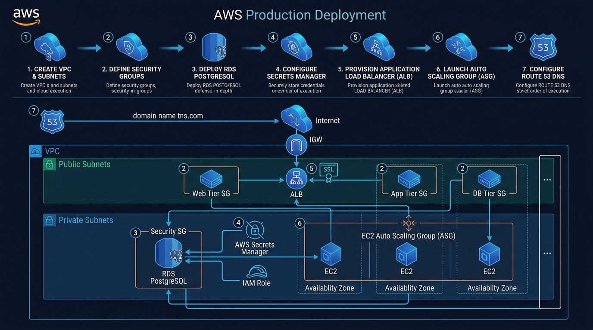

# 🗺️ Master Roadmap: AWS Production Deployment

Welcome to **Project 4: AWS Production Deployment**! ☁️🚀  
This project teaches you how to design, secure, and deploy a **real-world, multi-tier cloud application** on Amazon Web Services using the **AWS Management Console**.

---

## 🎯 Architecture Diagram & Workflow



```
                            THE INTERNET 🌐
                                   │
                                   ▼
                     [🌍 Amazon Route 53 (DNS)]
                                   │
                                   ▼
               [🔒 AWS Certificate Manager (HTTPS/SSL)]
                                   │
                                   ▼
          [⚖️ Application Load Balancer (ALB) - Public Subnets]
                                   │
                ┌──────────────────┴──────────────────┐
                ▼                                     ▼
     Availability Zone A                    Availability Zone B
┌───────────────────────────────┐     ┌───────────────────────────────┐
│ Public Subnet A (10.0.1.0/24) │     │ Public Subnet B (10.0.2.0/24) │
│ • ALB Listener A              │     │ • ALB Listener B              │
├───────────────────────────────┤     ├───────────────────────────────┤
│ App Subnet A (10.0.11.0/24)   │     │ App Subnet B (10.0.12.0/24)   │
│ • EC2 App Server #1           │     │ • EC2 App Server #2           │
│   (Auto Scaling Group)        │     │   (Auto Scaling Group)        │
├───────────────────────────────┤     ├───────────────────────────────┤
│ DB Subnet A (10.0.21.0/24)    │     │ DB Subnet B (10.0.22.0/24)    │
│ • Amazon RDS PostgreSQL       │◄───►│ • Multi-AZ Standby Replica    │
│   (Primary Writer)            │     │   (Automated Failover)        │
└───────────────────────────────┘     └───────────────────────────────┘
```

---

## 💡 The 3 Core Rules of Cloud Architecture

1. **Never use the Default VPC**: Always build a custom network to control boundaries.
2. **Never expose databases to the internet**: Databases live in private subnets with zero internet ingress.
3. **Never rely on a single server**: Deploy across multiple Availability Zones with Auto Scaling so servers auto-heal if one crashes.

---

## 🔢 The 11-Step Sequential Curriculum

Follow these guides in numerical order so every component is ready when the next one needs it:

| Step | Guide | What You Will Build | Key Goal |
| :---: | :--- | :--- | :--- |
| **01** | **[01-docker-hub-images.md](./01-docker-hub-images.md)** | Full-stack Docker containers (React client + Node.js backend), local testing & Docker Hub push (`ravi0706`) | Container artifacts ready |
| **02** | **[02-vpc-and-networking.md](./02-vpc-and-networking.md)** | Custom VPC (`10.0.0.0/16`), 6 Subnets across 2 AZs, IGW & Routes | Network foundation |
| **03** | **[03-security-groups-defense.md](./03-security-groups-defense.md)** | 3 Chained Security Groups (`alb-sg` $\rightarrow$ `ec2-app-sg` $\rightarrow$ `rds-db-sg`) | Zero-trust firewall rules |
| **04** | **[04-rds-database-mastery.md](./04-rds-database-mastery.md)** | DB Subnet Group & Amazon RDS PostgreSQL | Database endpoint created |
| **05** | **[05-s3-and-secrets-manager.md](./05-s3-and-secrets-manager.md)** | AWS Secrets Manager (`production/database/credentials`) + IAM Role | Safe credential storage |
| **06** | **[06-application-load-balancer.md](./06-application-load-balancer.md)** | Target Group (`/api/health`) & Application Load Balancer | Traffic director ready |
| **07** | **[07-ec2-launch-template-asg.md](./07-ec2-launch-template-asg.md)** | EC2 Launch Template with dynamic bootstrap + Auto Scaling Group | Auto-healing compute fleet |
| **08** | **[08-route53-and-https.md](./08-route53-and-https.md)** | Route 53 Custom Domain + Free ACM SSL/TLS Certificate | Secure HTTPS & domain |
| **09** | **[09-cloudwatch-monitoring.md](./09-cloudwatch-monitoring.md)** | CloudWatch CPU Alarms (>70%), SNS Email Alerts & Dashboard | Live observability |
| **10** | **[10-cost-management-cleanup.md](./10-cost-management-cleanup.md)** | \$1.00 Budget Alarm & Reverse-Order Teardown Checklist | 100% Free Tier protection |
| **11** | **[11-interview-masterclass.md](./11-interview-masterclass.md)** | 10 Technical Interview Questions, Elevator Pitch & Resume Bullets | Portfolio & interview ready |

---

## 📋 Cheat Sheet: What Values to Use

| Setting | Value to Use | Note |
| :--- | :--- | :--- |
| **Docker Username** | `ravi0706` | Images: `ravi0706/devops-client` & `devops-server` |
| **AWS Region** | `us-east-1` (N. Virginia) | Keep all services in the same region |
| **VPC CIDR** | `10.0.0.0/16` | Pre-configured in docs |
| **Database Name** | `devops_db` | Used by application backend |
| **Database User** | `postgres` | Default PostgreSQL master user |
| **Secret Name** | `production/database/credentials` | Used by `user-data.sh` to auto-fetch DB credentials |
| **EC2 IP Addresses** | **DO NOT hardcode** | Assigned dynamically by AWS Auto Scaling |

---

## 🚀 Ready to Begin?

Start by building your Docker containers and pushing them to Docker Hub:  
👉 **[Start Step 1: 01-docker-hub-images.md](./01-docker-hub-images.md)**
