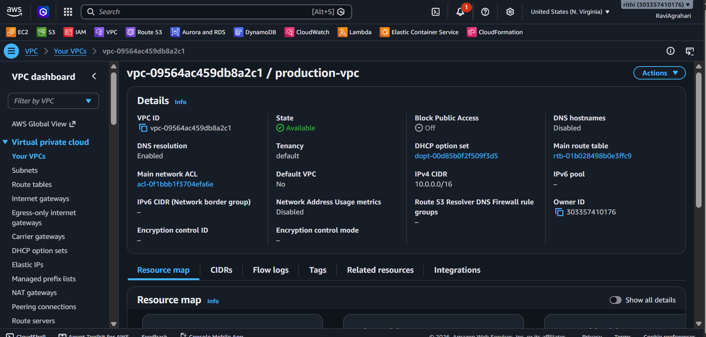
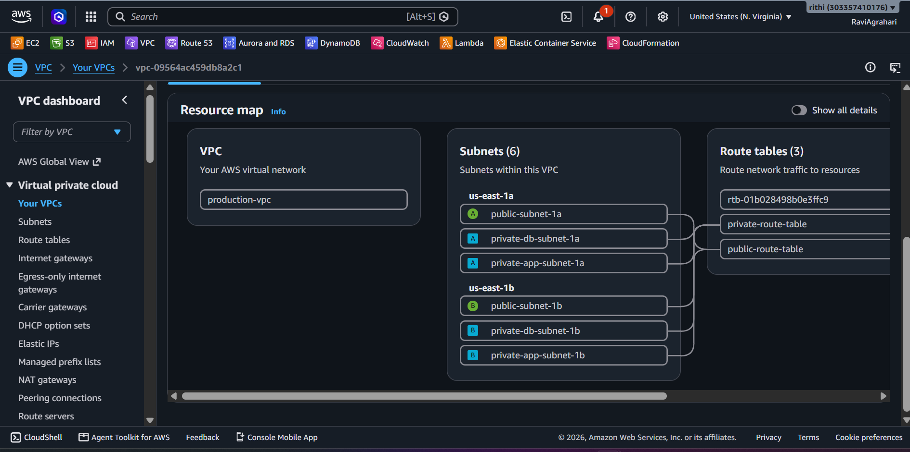
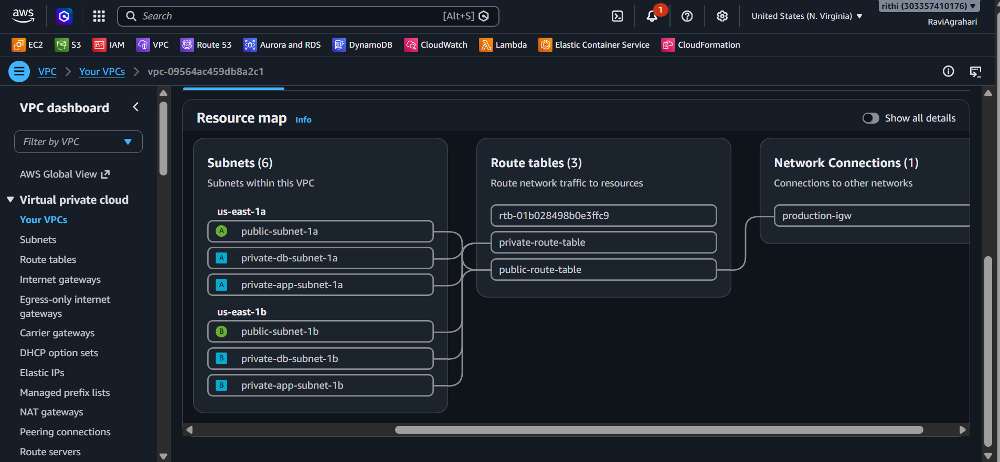

# 🌐 Step 1: Virtual Private Cloud (VPC) & Multi-AZ Networking

Welcome to **Step 1**! 🚀  
One of the most critical principles in professional cloud engineering is: **Never deploy production systems directly into the AWS Default VPC**.  
In this step, you will build a isolated **custom Amazon Virtual Private Cloud (VPC)** with public, private application, and private database subnets spanning across **two Availability Zones**.

---

## 🏰 The Analogy: Building a Secure Gated Castle

Think of your cloud infrastructure like a secure medieval castle:

```
┌─────────────────────────────────────────────────────────────┐
│ 🏰 CUSTOM VPC (10.0.0.0/16) - Your Private Estate           │
│                                                             │
│  [PUBLIC SUB-DISTRICT] (Front Gate & Courtyard)             │
│   • Internet Gateway (Drawbridge to the outside world 🌍)   │
│   • Application Load Balancer (Security guards checking IDs)│
│                                                             │
│  [PRIVATE RESIDENTIAL DISTRICT] (Inside Castle Walls)       │
│   • EC2 Application Servers (Cooks & Staff)                 │
│   • Cannot be contacted directly from outside the castle!   │
│                                                             │
│  [UNDERGROUND VAULT] (Deepest Secret Chamber)               │
│   • Amazon RDS Database (The Royal Treasure 👑)             │
│   • ZERO outside doors. Only accessible by castle staff!    │
└─────────────────────────────────────────────────────────────┘
```

---

## 🔢 Understanding CIDR Notation (Without the Headache!)

When creating networks in AWS, you define IP address blocks using **CIDR notation** (e.g., `10.0.0.0/16`):

| CIDR Block | Total IPs | Usable Server IPs | Best Used For |
| :--- | :---: | :---: | :--- |
| **`10.0.0.0/16`** | 65,536 | 65,531 | Entire Custom VPC Network |
| **`10.0.x.0/24`** | 256 | 251 | Individual Subnets |

> [!NOTE]
> AWS reserves 5 IP addresses in every subnet for network routing, router interface, DNS, future use, and broadcast. A `/24` subnet gives you $256 - 5 = 251$ usable server IP addresses.

---

## 🗺️ Our 6-Subnet Architecture Across 2 Availability Zones

To ensure high availability (so your website stays online even if an entire AWS data center suffers an outage), we deploy subnets across **two Availability Zones** (`us-east-1a` and `us-east-1b`):

```
production-vpc (10.0.0.0/16)
│
├── 📍 Availability Zone A (e.g. us-east-1a)
│   ├── 🌐 Public Subnet 1a:     10.0.1.0/24   (For Application Load Balancer)
│   ├── 🔒 Private App Subnet 1a: 10.0.11.0/24  (For EC2 Application Fleet)
│   └── 🐘 Private DB Subnet 1a:  10.0.21.0/24  (For Amazon RDS Primary DB)
│
└── 📍 Availability Zone B (e.g. us-east-1b)
    ├── 🌐 Public Subnet 1b:     10.0.2.0/24   (For Application Load Balancer)
    ├── 🔒 Private App Subnet 1b: 10.0.12.0/24  (For EC2 Application Fleet)
    └── 🐘 Private DB Subnet 1b:  10.0.22.0/24  (For Amazon RDS Standby DB)
```

---

## 🖱️ Step-by-Step AWS Management Console Walkthrough

### Part 1: Create the Custom VPC

1. Open the [AWS Management Console](https://console.aws.amazon.com/) and navigate to the **VPC Console**.
2. Make sure your region in the top right is set to your preferred region (e.g., **N. Virginia / us-east-1**).
3. In the left navigation menu, click **Your VPCs** $\rightarrow$ Click the orange **Create VPC** button.
4. Fill in the details:
   - **Resources to create**: Select **VPC only** (we will build subnets manually to master the concepts!).
   - **Name tag**: `production-vpc`
   - **IPv4 CIDR block**: Select **IPv4 CIDR manual input**.
   - **IPv4 CIDR**: `10.0.0.0/16`
   - **Tenancy**: `Default`
5. Click **Create VPC**! 🎉

---

### Part 2: Create the 6 Subnets

In the left menu, click **Subnets** $\rightarrow$ Click **Create subnet**. Select `production-vpc`.

Create each subnet with the exact settings below:

#### Availability Zone A (e.g. `us-east-1a`):
1. **Public Subnet 1A**:
   - Subnet name: `public-subnet-1a`
   - Availability Zone: Select your first AZ (e.g. `us-east-1a`)
   - IPv4 CIDR block: `10.0.1.0/24`
2. **Private App Subnet 1A**:
   - Subnet name: `private-app-subnet-1a`
   - Availability Zone: `us-east-1a`
   - IPv4 CIDR block: `10.0.11.0/24`
3. **Private DB Subnet 1A**:
   - Subnet name: `private-db-subnet-1a`
   - Availability Zone: `us-east-1a`
   - IPv4 CIDR block: `10.0.21.0/24`

#### Availability Zone B (e.g. `us-east-1b`):
4. **Public Subnet 1B**:
   - Subnet name: `public-subnet-1b`
   - Availability Zone: Select your second AZ (e.g. `us-east-1b`)
   - IPv4 CIDR block: `10.0.2.0/24`
5. **Private App Subnet 1B**:
   - Subnet name: `private-app-subnet-1b`
   - Availability Zone: `us-east-1b`
   - IPv4 CIDR block: `10.0.12.0/24`
6. **Private DB Subnet 1B**:
   - Subnet name: `private-db-subnet-1b`
   - Availability Zone: `us-east-1b`
   - IPv4 CIDR block: `10.0.22.0/24`

Click **Create subnet**.

> [!IMPORTANT]
> **Enable Auto-Assign Public IP for Public & Application Subnets**:
> For EC2 instances to run `apt-get install` and `docker pull` without an expensive paid NAT Gateway ($33/month), they need outbound internet access via the Internet Gateway (while remaining 100% protected inbound by your Security Group!).
> 1. In the Subnets list, select `public-subnet-1a` $\rightarrow$ Click **Actions** $\rightarrow$ **Edit subnet settings**.
> 2. Check the box ✅ **Enable auto-assign public IPv4 address** $\rightarrow$ Click **Save**.
> 3. Repeat this for `public-subnet-1b`, `private-app-subnet-1a`, and `private-app-subnet-1b`.
> *(Leave `private-db-subnet-1a` and `private-db-subnet-1b` set to NO public IP!)*

---

### Part 3: Create & Attach an Internet Gateway (IGW)

An Internet Gateway acts as the bridge connecting your VPC to the public internet:

1. In the left VPC menu, click **Internet Gateways** $\rightarrow$ Click **Create internet gateway**.
2. **Name tag**: `production-igw` $\rightarrow$ Click **Create internet gateway**.
3. Once created, click **Actions** $\rightarrow$ **Attach to VPC**.
4. Select `production-vpc` $\rightarrow$ Click **Attach internet gateway**! 🌐

---

### Part 4: Configure Route Tables (Application vs Database)

#### 1. Public / Application Route Table (With Internet Access):
1. In the left menu, click **Route Tables** $\rightarrow$ Click **Create route table**.
2. **Name**: `public-route-table` $\rightarrow$ Select `production-vpc` $\rightarrow$ Click **Create**.
3. Click the **Routes** tab $\rightarrow$ Click **Edit routes**.
4. Click **Add route**:
   - **Destination**: `0.0.0.0/0` (All internet traffic)
   - **Target**: Select **Internet Gateway** $\rightarrow$ choose `production-igw`.
   - Click **Save changes**.
5. Click the **Subnet associations** tab $\rightarrow$ Click **Edit subnet associations**.
6. Check the 4 subnets that need outbound internet access:
   - ✅ `public-subnet-1a`
   - ✅ `public-subnet-1b`
   - ✅ `private-app-subnet-1a`
   - ✅ `private-app-subnet-1b`
7. Click **Save associations**.

#### 2. Database Private Route Table (Zero Internet Exposure):
1. Click **Create route table**.
2. **Name**: `database-private-route-table` $\rightarrow$ Select `production-vpc` $\rightarrow$ Click **Create**.
3. Click the **Subnet associations** tab $\rightarrow$ Click **Edit subnet associations**.
4. Check only the 2 database subnets:
   - ✅ `private-db-subnet-1a`
   - ✅ `private-db-subnet-1b`
5. Click **Save associations**.  
   *(Notice: The database route table has NO route to the Internet Gateway. Your PostgreSQL database has zero internet access and can only be reached internally from your EC2 application servers!)* 🛡️

> [!NOTE]
> **Enterprise Tip (NAT Gateway vs Internet Gateway)**:  
> In multi-million dollar corporate setups, companies deploy an **AWS NAT Gateway** ($32.40/month + data charges) so private instances have outbound internet access without public IPs. For learning on the **AWS Free Tier ($0.00)**, routing app subnets through the Internet Gateway with **strict Security Group firewalls** achieves the exact same security posture for free!

---

## 🔍 Checkpoints: How to Verify & See Your Network Ready

### 1. View the AWS VPC "Resource Map"
- In the VPC Console, click on `production-vpc`.
- Scroll down to the **Resource map** tab!
- AWS renders a live visual diagram showing:  
  `production-vpc` $\longrightarrow$ 6 Subnets $\longrightarrow$ 2 Route Tables $\longrightarrow$ `production-igw`! 🗺️  
  *If all 6 subnets and both route tables are connected, your network is 100% verified.*

### 2. Verify Public vs Private Subnet Configuration
- Click **Subnets** $\rightarrow$ select `public-subnet-1a`:
  - Verify **Auto-assign public IPv4 address**: `Yes` 🟢
- Select `private-app-subnet-1a`:
  - Verify **Auto-assign public IPv4 address**: `No` 🔒

---

## 📸 Proof of Work: Screenshots

### 🖼️ Screenshot 1: Custom VPC Created in AWS Console


### 🖼️ Screenshot 2: Six Multi-AZ Subnets Created


### 🖼️ Screenshot 3: Internet Gateway Attached & Route Table Configured


---

## ⏭️ Ready for Step 2?

Now let's build our layered firewall defense with Security Groups:  
👉 **[Go to Step 2: 02-security-groups-defense.md](./02-security-groups-defense.md)**
