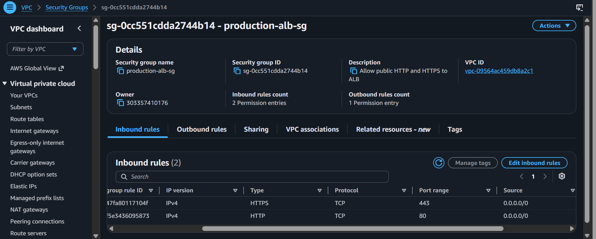
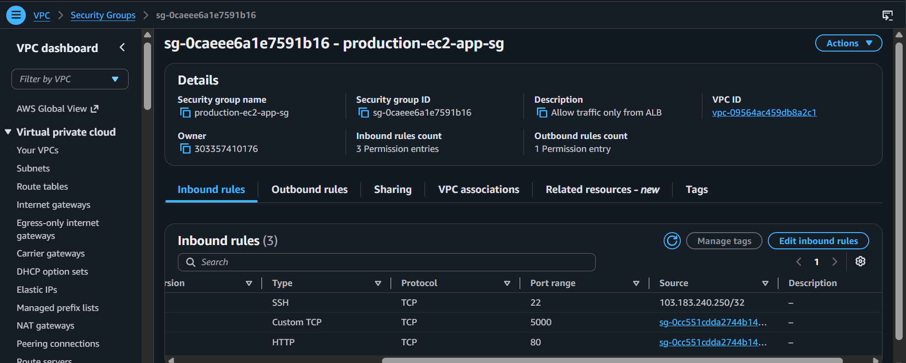
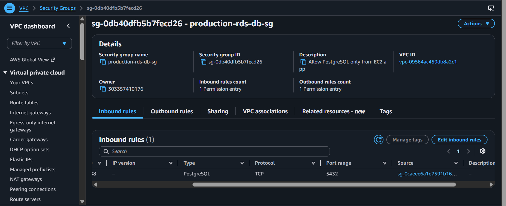

# 🛡️ Step 2: Layered Security Groups (Zero-Trust Defense)

Welcome to Day 2! 🛡️  
In this step, you will engineer an **enterprise-grade layered firewall defense**.

---

## 🚫 The Junior Mistake vs. The Senior Architecture

### ❌ The Junior Mistake:

Opening Port 5432 (Postgres) or Port 5000 (Express) to `0.0.0.0/0` (Anywhere).  
If an attacker discovers your IP address, they can brute-force your database directly!

### The Senior Architecture: Security Group Chaining

Instead of IP addresses, AWS allows you to use a **Security Group as the Source** for another Security Group!

```
                  THE PUBLIC INTERNET 🌐
                            │
                            ▼ Allowed: 0.0.0.0/0 (Ports 80 & 443)
                 ┌──────────────────────┐
                 │ ⚖️ ALB Security Group │
                 │      (alb-sg)        │
                 └──────────┬───────────┘
                            │
                            ▼ Allowed ONLY from: "alb-sg" (Ports 80 & 5000)
                 ┌──────────────────────┐
                 │ 💻 EC2 Security Group│
                 │     (ec2-app-sg)     │
                 └──────────┬───────────┘
                            │
                            ▼ Allowed ONLY from: "ec2-app-sg" (Port 5432)
                 ┌──────────────────────┐
                 │ 🐘 RDS Security Group│
                 │     (rds-db-sg)      │
                 └──────────────────────┘
```

> [!IMPORTANT]
> **Why this is virtually impenetrable**:
> Even if someone on the internet discovers the private IP or endpoint of your database, AWS drops their network packets at the hypervisor level. Only traffic originating from inside an authorized EC2 instance can reach the database! 🔒

---

## 📋 The 3 Security Groups We Will Create

| Security Group   | Purpose                      | Inbound Rules                                                                                                         | Outbound Rules            |
| :--------------- | :--------------------------- | :-------------------------------------------------------------------------------------------------------------------- | :------------------------ |
| **`alb-sg`**     | Front door for Load Balancer | • HTTP (Port 80) from `0.0.0.0/0`<br>• HTTPS (Port 443) from `0.0.0.0/0`                                              | All traffic (`0.0.0.0/0`) |
| **`ec2-app-sg`** | Application EC2 Servers      | • HTTP (Port 80) from `alb-sg`<br>• Custom TCP (Port 5000) from `alb-sg`<br>• SSH (Port 22) from **My IP** (Optional) | All traffic (`0.0.0.0/0`) |
| **`rds-db-sg`**  | Amazon RDS Database          | • PostgreSQL (Port 5432) from `ec2-app-sg`                                                                            | All traffic (`0.0.0.0/0`) |

---

## 🖱️ Step-by-Step AWS Management Console Walkthrough

### 1. Create `alb-sg` (Application Load Balancer Firewall)

1. Open the [AWS VPC Console](https://console.aws.amazon.com/vpc/).
2. In the left menu, click **Security Groups** $\rightarrow$ Click **Create security group**.
3. Basic details:
   - **Security group name**: `production-alb-sg`
   - **Description**: `Allow public HTTP and HTTPS to ALB`
   - **VPC**: Select your `production-vpc`.
4. **Inbound rules** $\rightarrow$ Click **Add rule**:
   - Rule 1: Type: `HTTP` | Port: `80` | Source: `Anywhere-IPv4` (`0.0.0.0/0`).
   - Rule 2: Type: `HTTPS` | Port: `443` | Source: `Anywhere-IPv4` (`0.0.0.0/0`).
5. Click **Create security group**.
6. 📋 Note the generated ID (e.g., `sg-01a2b3c4d5e6f7g8h`).

---

### 2. Create `ec2-app-sg` (EC2 Application Firewall)

1. Click **Create security group**.
2. Basic details:
   - **Security group name**: `production-ec2-app-sg`
   - **Description**: `Allow traffic only from ALB`
   - **VPC**: Select `production-vpc`.
3. **Inbound rules** $\rightarrow$ Click **Add rule**:
   - Rule 1: Type: `HTTP` | Port: `80` | Source: In the search box, select `production-alb-sg`!
   - Rule 2: Type: `Custom TCP` | Port: `5000` | Source: Select `production-alb-sg`!
   - Rule 3 (Optional for debugging): Type: `SSH` | Port: `22` | Source: Select `My IP` (Only your laptop can connect!).
4. Click **Create security group**.
5. 📋 Note the generated ID.

---

### 3. Create `rds-db-sg` (Database Firewall)

1. Click **Create security group**.
2. Basic details:
   - **Security group name**: `production-rds-db-sg`
   - **Description**: `Allow PostgreSQL only from EC2 app servers`
   - **VPC**: Select `production-vpc`.
3. **Inbound rules** $\rightarrow$ Click **Add rule**:
   - Rule 1: Type: `PostgreSQL` | Port: `5432` | Source: Select `production-ec2-app-sg`!
4. Click **Create security group**.

🎉 **Your 3-tier firewall chain is complete!**

---

## 🔍 Checkpoints: How to Verify the Firewall Chain

1. **Verify Source References Security Group IDs (Not 0.0.0.0/0)**:
   - Click on `production-ec2-app-sg` $\rightarrow$ **Inbound rules** tab:
     - Check that the **Source** shows `sg-xxxx (production-alb-sg)` instead of an IP address!
   - Click on `production-rds-db-sg` $\rightarrow$ **Inbound rules** tab:
     - Check that the **Source** shows `sg-xxxx (production-ec2-app-sg)`!

2. **Verify Zero Direct Database Exposure**:
   - Notice that `production-rds-db-sg` has **NO rule** for `0.0.0.0/0`.
   - Even if someone knows the RDS master password and endpoint, outside network packets are dropped at the hypervisor! 🛡️

---

## 📸 Proof of Work: Screenshots

> [!TIP]
> Save your screenshots into `docs/screenshots/` and update these links:

### 🖼️ Screenshot 1: ALB Security Group with Public Ingress



### 🖼️ Screenshot 2: EC2 Security Group Chained to ALB SG



### 🖼️ Screenshot 3: RDS Security Group Chained to EC2 SG



## ⏭️ Ready for Day 3?

Now let's launch our managed cloud database on Amazon RDS:  
👉 **[Go to Step 3: 03-rds-database-mastery.md](./03-rds-database-mastery.md)**
