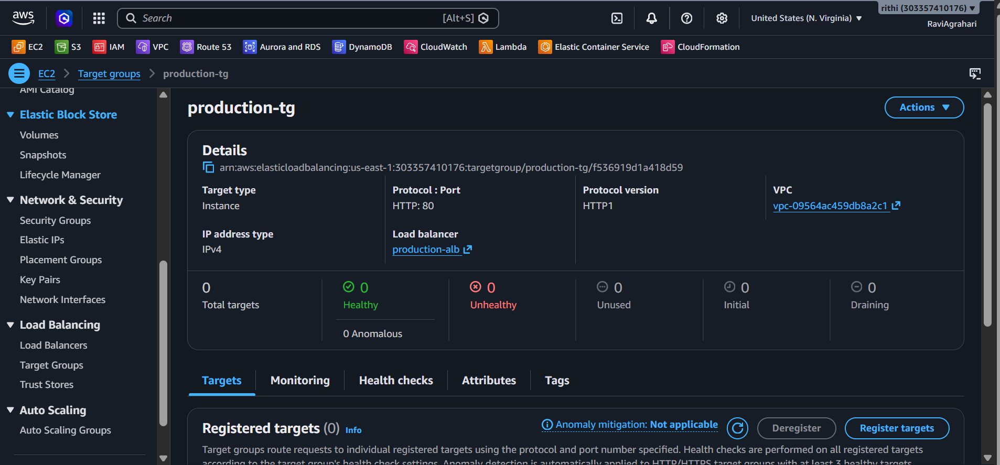
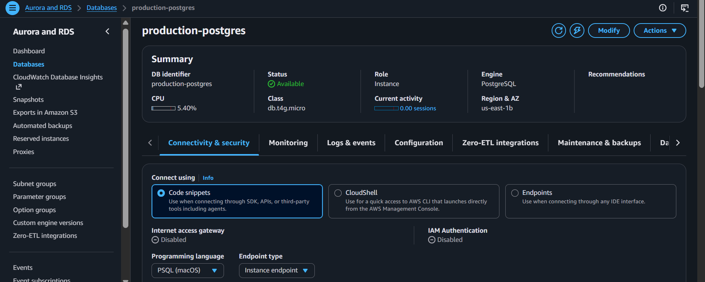

# ⚖️ Step 5: Application Load Balancer (ALB) Mastery

Welcome to **Step 5**! ⚖️  
In production cloud environments, client browsers should never communicate directly with individual server IP addresses.  
Instead, an **Application Load Balancer (ALB)** acts as the high-availability traffic director sitting in front of your application fleet.

---

## 🎯 Why Do We Use an Application Load Balancer?

```
                     Users & Browsers 🌐
                             │
                             ▼
             ┌───────────────────────────────┐
             │ Application Load Balancer ⚖️  │  • Single DNS entry point
             │   (Public Subnets 1a & 1b)    │  • Terminate HTTPS / SSL certificates
             └───────────────┬───────────────┘  • Automated continuous health checks
                             │
              ┌──────────────┴──────────────┐
              ▼                             ▼
       EC2 Instance #1               EC2 Instance #2
    (Private Subnet 1a)           (Private Subnet 1b)
```

### 🌟 4 Superpowers of the ALB:
1. **Traffic Distribution**: Balances incoming requests evenly so no single EC2 instance is overloaded.
2. **Multi-AZ High Availability**: Deployed redundantly across Public Subnet 1A and Public Subnet 1B.
3. **Automated Health Probing**: Regularly pings `/api/health`. If an EC2 instance crashes, the ALB instantly stops sending traffic to it until it recovers!
4. **SSL/TLS Offloading**: Manages domain SSL certificates in one central place without consuming server CPU cycles.

---

## 🧩 The 3 Core Pieces of Load Balancing

| Component | What It Does | Real-World Analogy |
| :--- | :--- | :--- |
| **Listener** 👂 | Listens on a port (e.g., HTTP 80 or HTTPS 443) for incoming traffic. | The receptionist answering incoming phone calls. |
| **Rules** 📋 | Decides where to forward each request based on path or host headers. | The call routing menu ("Press 1 for Support"). |
| **Target Group** 🎯 | The pool of backend servers (EC2 instances) that process requests. | The customer service agents handling the calls. |

---

## 🖱️ Step-by-Step AWS Management Console Walkthrough

### Part 1: Create the Target Group

The Target Group defines *where* to forward incoming traffic and *how* to monitor backend health:

1. Open the [AWS EC2 Console](https://console.aws.amazon.com/ec2/).
2. In the left navigation menu under **Load Balancing**, click **Target Groups**.
3. Click the orange **Create target group** button.
4. **Step 1: Specify group details**:
   - **Target type**: Select **Instances** 💻.
   - **Target group name**: `production-tg`
   - **Protocol**: `HTTP` | **Port**: `80`
   - **IP address type**: `IPv4`
   - **VPC**: Select `production-vpc`.
   - **Protocol version**: `HTTP1`
5. **Health checks configuration**:
   - **Health check protocol**: `HTTP`
   - **Health check path**: `/api/health` 🩺 *(Our backend health check endpoint!)*
   - Expand **Advanced health check settings**:
     - **Healthy threshold**: `2` (Consecutive successful probes before marking instance healthy)
     - **Unhealthy threshold**: `2` (Consecutive failed probes before removing traffic)
     - **Timeout**: `5` seconds
     - **Interval**: `15` seconds
     - **Success codes**: `200`
6. Click **Next**.
7. **Step 2: Register targets**:
   - Since our Auto Scaling Group will register instances automatically in Step 6, skip manual instance selection and click **Create target group**! 🎉

---

### Part 2: Create the Application Load Balancer

1. In the left EC2 menu under **Load Balancing**, click **Load Balancers** $\rightarrow$ Click **Create load balancer**.
2. Under **Application Load Balancer**, click **Create**.
3. **Basic configuration**:
   - **Load balancer name**: `production-alb`
   - **Scheme**: Select **Internet-facing** 🌐 *(Accepts traffic from the public web)*.
   - **IP address type**: `IPv4`.
4. **Network mapping**:
   - **VPC**: Select your `production-vpc`.
   - **Mappings (Select 2 Availability Zones)**:
     - Check Zone 1 (e.g., `us-east-1a`) $\rightarrow$ Select `public-subnet-1a`.
     - Check Zone 2 (e.g., `us-east-1b`) $\rightarrow$ Select `public-subnet-1b`.
5. **Security groups**:
   - Remove the default security group.
   - Select: `production-alb-sg` 🛡️.
6. **Listeners and routing**:
   - **Protocol**: `HTTP` | **Port**: `80`.
   - **Default action**: Forward to $\rightarrow$ Select `production-tg`.
7. Click **Create load balancer** at the bottom! 🚀

---

## 🔍 Checkpoints: How to Verify & See It Running

### 1. Verify ALB State is Active
- In the **Load Balancers** table, check the **State** column for `production-alb`.
- It will transition from *Provisioning* to **Active** with a green icon 🟢 (takes about 2 minutes).

### 2. Copy the ALB Public DNS Name
- Select `production-alb` $\rightarrow$ under the **Description** tab, locate **DNS name**:
  ```text
  production-alb-123456789.us-east-1.elb.amazonaws.com
  ```
- Keep this DNS name handy; once our Auto Scaling Group launches instances in Step 6, this URL will serve your full-stack web application!

---

## 📸 Proof of Work: Screenshots

### 🖼️ Screenshot 1: Target Group Configured with Health Checks


### 🖼️ Screenshot 2: Application Load Balancer Active Across Public Subnets


---

## ⏭️ Ready for Step 6?

Now let's create the Auto Scaling Group and Launch Template that automatically boots EC2 instances and connects to this Target Group:  
👉 **[Go to Step 6: 06-ec2-launch-template-asg.md](./06-ec2-launch-template-asg.md)**
