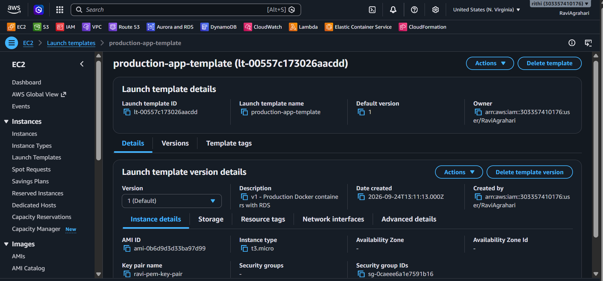
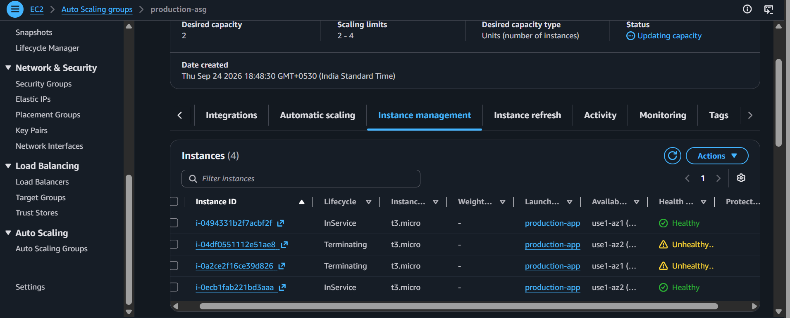
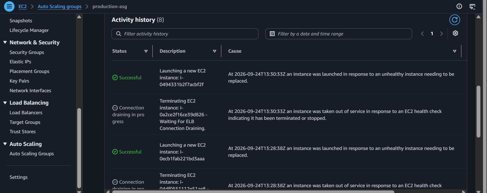

# 📈 Step 6: EC2 Launch Templates & Multi-AZ Auto Scaling

Welcome to Day 6! 📈  
Today, you build the **self-healing, auto-scaling engine** of your cloud infrastructure.

---

## 🤖 What is Auto Scaling & Self-Healing?

In legacy systems, if a server's hard drive died at 3 AM on a Saturday, an engineer had to wake up and manually rebuild it.

In modern AWS cloud:

1. **Self-Healing**: If Server #1 crashes, the **Auto Scaling Group (ASG)** notices within 60 seconds, terminates the broken machine, and launches a fresh replacement automatically! 🪄
2. **Elastic Scaling**: During Black Friday or a traffic surge, the ASG scales out from 2 servers to 4 servers. When traffic calms down, it scales back in to 2 servers to save money! 💰

```
                      User Traffic Surges 📈
                                │
                                ▼
                 [Auto Scaling Group (ASG)]
                                │
           ┌────────────────────┴────────────────────┐
           ▼                                         ▼
 Availability Zone A                       Availability Zone B
┌───────────────────────┐                 ┌───────────────────────┐
│ EC2 Instance #1       │                 │ EC2 Instance #2       │
│ (Private Subnet 1a)   │                 │ (Private Subnet 1b)   │
└───────────────────────┘                 └───────────────────────┘
           │ (Spawns under heavy load)               │
           ▼                                         ▼
┌───────────────────────┐                 ┌───────────────────────┐
│ EC2 Instance #3       │                 │ EC2 Instance #4       │
│ (Private Subnet 1a)   │                 │ (Private Subnet 1b)   │
└───────────────────────┘                 └───────────────────────┘
```

---

## 📜 1. What is an EC2 Launch Template?

A **Launch Template** is an immutable cookie-cutter blueprint. It specifies:

- Which Operating System to use (Ubuntu 24.04 LTS).
- Which instance size (`t2.micro` or `t3.micro`).
- Which Security Group to attach (`production-ec2-app-sg`).
- Which bootstrap script (**User Data**) to execute on startup.

---

## 🖱️ Step-by-Step AWS Management Console Walkthrough

### Part 1: Create the Launch Template

1. Open the [AWS EC2 Console](https://console.aws.amazon.com/ec2/).
2. In the left menu under **Instances**, click **Launch Templates** $\rightarrow$ Click **Create launch template**.
3. Template details:
   - **Launch template name**: `production-app-template`
   - **Template version description**: `v1 - Production Docker containers with RDS`
   - Check ✅ **Provide guidance to help set up a template for use with Auto Scaling**.
4. **Application and OS Images (Amazon Machine Image)**:
   - Select **Quick Start** $\rightarrow$ choose **Ubuntu** (`Ubuntu Server 24.04 LTS`, 64-bit x86). _Free tier eligible_.
5. **Instance type**:
   - Choose `t2.micro` (or `t3.micro`).
6. **Key pair (login)**:
   - Choose your existing key pair (e.g. `devops-ec2-key`) or create a new one.
7. **Network settings**:
   - **Subnet**: Select **Don't include in launch template** _(The Auto Scaling Group will pick the subnets!)_.
   - **Security groups**: Select `production-ec2-app-sg` 🛡️.
8. **Advanced details (Scroll to the very bottom)**:
   - Expand **Advanced details**.
   - Scroll down to the **User data** box.
   - Paste the contents of `aws-production-deployment-project/app/user-data.sh`:

```bash
#!/bin/bash
set -e
exec > >(tee /var/log/user-data.log|logger -t user-data -s 2>/dev/console) 2>&1

# 1. Update OS packages
apt-get update -y
apt-get install -y docker.io docker-compose-v2 curl

# 2. Enable Docker
systemctl enable --now docker
usermod -aG docker ubuntu

# 3. Create app folder and start containers
mkdir -p /home/ubuntu/app
cd /home/ubuntu/app

cat << 'EOF' > docker-compose.yml
services:
  server:
    image: agravi987/devops-server:latest
    container_name: aws_backend
    restart: always
    environment:
      PORT: 5000
      NODE_ENV: production
      DB_HOST: ${DB_HOST}
      DB_PORT: 5432
      DB_USER: postgres
      DB_PASSWORD: ${DB_PASSWORD}
      DB_NAME: devops_db
    ports:
      - "5000:5000"
    networks:
      - app_network

  client:
    image: agravi987/devops-client:latest
    container_name: aws_frontend
    restart: always
    ports:
      - "80:80"
    depends_on:
      - server
    networks:
      - app_network

networks:
  app_network:
    driver: bridge
EOF

# -------------------------------------------------------------
# Option A: Modern Production Approach (AWS Secrets Manager) 🔐
# (Recommended: Zero hardcoded credentials + eliminates chicken-and-egg!)
# -------------------------------------------------------------
# If you created a secret in AWS Secrets Manager named "production/app/secrets":
# SECRET_JSON=$(aws secretsmanager get-secret-value --secret-id production/app/secrets --query SecretString --output text --region us-east-1)
# echo $SECRET_JSON | jq -r 'to_entries|map("\(.key)=\(.value|tostring)")|.[]' > .env

# -------------------------------------------------------------
# Option B: Direct Environment File Configuration 📝
# -------------------------------------------------------------
# Replace with your actual Amazon RDS endpoint once created in Step 5!
cat << 'ENVEOF' > .env
DOCKER_USERNAME=agravi987
IMAGE_TAG=latest
DB_HOST=REPLACE_WITH_YOUR_RDS_ENDPOINT
DB_PORT=5432
DB_USER=postgres
DB_PASSWORD=YourSecurePassword123
DB_NAME=devops_db
ENVEOF

docker compose pull
docker compose up -d
```

> [!TIP]
> **What if you created this Launch Template before creating RDS?**
> Don't worry! AWS Launch Templates have **built-in versioning**:
> 1. Once you create your RDS in Step 5, copy the RDS endpoint.
> 2. Go to **Launch Templates** $\rightarrow$ select `production-app-template` $\rightarrow$ **Actions** $\rightarrow$ **Modify template (Create new version)**.
> 3. Update the `DB_HOST` line with the real endpoint $\rightarrow$ Save as **Version 2**.
> 4. Set Version 2 as **Default**, and your Auto Scaling Group will automatically launch instances using the real database!

9. Click **Create launch template**! 🎉

---

### Part 2: Create the Auto Scaling Group (ASG)

1. In the left EC2 menu, scroll to the bottom $\rightarrow$ click **Auto Scaling Groups**.
2. Click the orange **Create Auto Scaling group** button.
3. **Step 1: Choose launch template or configuration**:
   - **Auto Scaling group name**: `production-asg`
   - **Launch template**: Select `production-app-template` (Version: Default `1`).
   - Click **Next**.
4. **Step 2: Choose instance launch options**:
   - **VPC**: Select `production-vpc`.
   - **Availability Zones and subnets**:
     - Check `private-app-subnet-1a` 🔒
     - Check `private-app-subnet-1b` 🔒  
       _(Notice: We select our PRIVATE app subnets. The application servers are protected inside the private castle walls!)_
   - Click **Next**.
5. **Step 3: Configure advanced options**:
   - Under **Load balancing**, choose **Attach to an existing load balancer**.
   - Select **Choose from your load balancer target groups**.
   - **Existing target groups**: Select `production-tg`! 🎯
   - Under **Health checks**:
     - Check ✅ **Turn on Elastic Load Balancing health checks** _(If the ALB marks an instance unhealthy, ASG replaces it automatically!)_
     - **Health check grace period**: `300` seconds.
   - Click **Next**.
6. **Step 4: Configure group size and scaling policies**:
   - **Desired capacity**: `2` (Runs 2 EC2 instances at all times across AZs)
   - **Minimum capacity**: `2`
   - **Maximum capacity**: `4`
   - Under **Automatic scaling**: Choose **Target tracking scaling policy**:
     - **Metric type**: `Average CPU utilization`
     - **Target value**: `70` (If CPU > 70%, add a server; if CPU drops, remove a server).
   - Click **Next** $\rightarrow$ Click **Next** through Notifications and Tags.
7. Click **Create Auto Scaling group**! 🚀

---

## 🔍 Checkpoints: How to Verify & See Everything Running Live

Here is the exact checklist to verify your application and auto-scaling stack are healthy:

### 1. Check EC2 Instances Status in Console
- Go to **EC2** $\rightarrow$ **Instances**.
- You will see two instances named `production-asg` with state **Running** 🟢.
- Status check should show **2/2 checks passed**.

### 2. Verify Container Startup Logs (Inside EC2)
Connect to an instance via **EC2 Instance Connect** (or SSH) and check the bootstrap log:
```bash
# View the live User Data bootstrap log:
sudo cat /var/log/user-data.log
```
*You will see Docker installing, pulling images, and starting containers!*

### 3. Verify Docker Containers are Running
On the EC2 instance, type:
```bash
docker ps
```
You should see both containers active:
- `aws_frontend` (Port 80)
- `aws_backend` (Port 5000)

### 4. Test Local Container Health Endpoint
On the EC2 instance, test the health check:
```bash
curl http://localhost/api/health
```
*Expected response*: `{"status":"UP","uptimeSeconds":...,"database":"connected"}` 🎉

### 5. Check Target Group Health in AWS Console
- Go to **EC2** $\rightarrow$ **Target Groups** $\rightarrow$ `production-tg` $\rightarrow$ **Targets** tab.
- Both EC2 instances should show Health status: **Healthy** in green 🟢!

### 6. Open the Application Load Balancer in Your Browser!
- Go to **EC2** $\rightarrow$ **Load Balancers** $\rightarrow$ `production-alb`.
- Copy the **DNS name** (e.g. `http://production-alb-123456.us-east-1.elb.amazonaws.com`).
- Open it in your web browser:
  **Your live React frontend will load, communicating through the ALB to your backend containers and Amazon RDS!** 🥳

---

## 🧪 The "Chaos Monkey" Self-Healing Test!

Want to see AWS self-healing with your own eyes?

1. Go to the **EC2 Instances** dashboard.
2. Select one of your two running instances $\rightarrow$ Click **Instance state** $\rightarrow$ **Terminate instance** 💥.
3. Go to **Auto Scaling Groups** $\rightarrow$ click on `production-asg` $\rightarrow$ **Activity tab**:
   - You will see: _Instance was terminated (unhealthy)._
   - Followed by: _Launching a new EC2 instance to maintain desired capacity of 2!_ 🪄
4. Within 2 minutes, a new server is online, passes health checks, and is added to the ALB Target Group automatically!

---

## 📸 Proof of Work: Screenshots

> [!TIP]
> Save your screenshots into `docs/screenshots/` and update these links:

### 🖼️ Screenshot 1: Launch Template with User Data Script



### 🖼️ Screenshot 2: Auto Scaling Group Across Multi-AZ Private Subnets



### 🖼️ Screenshot 3: Auto-Healing Activity History



---

## ⏭️ Ready for Day 7?

Now let's configure Route 53 Custom Domains and free SSL/TLS certificates (HTTPS):  
👉 **[Go to Step 7: 07-route53-and-https.md](./07-route53-and-https.md)**
